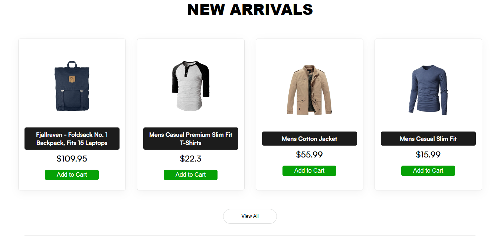
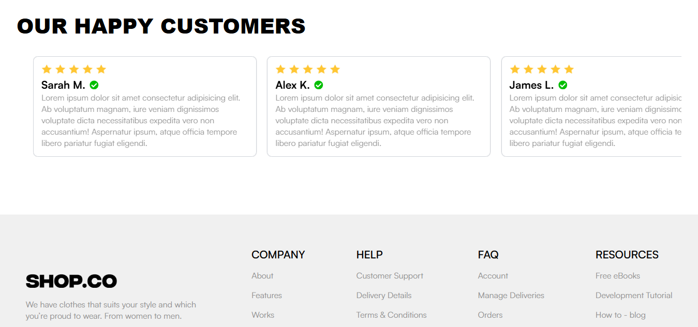

# Shop.Co APP

### 🚨 PROJETO DESCONTINUADO 🚨

Shop.CO é um E-commerce focado em roupas de luxo criado com MERN ( MongoDB, Express, React e Node). Um projeto simples que construi no intuito de entender melhor integração do back-end com o front-end.  
O front-end foi feito com base em um design gratuito do Figma: https://www.figma.com/community/file/1273571982885059508/e-commerce-website-template-freebie
## Imagem do projeto:

## Principais Features:
- Carrinho de compras 
- Pesquisar por item específico 
- Escolher determinadas categorias 
- Login e Cadastro
- Alterar senhas e apagar contas
- Autenticação JWT

## Tecnologias Usadas:
- React
- Node.Js
- Express
- MongoDB
- FakeStore API (Doc: https://fakestoreapi.com/)

## Outras imagens do projeto:

